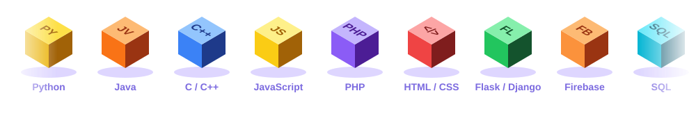
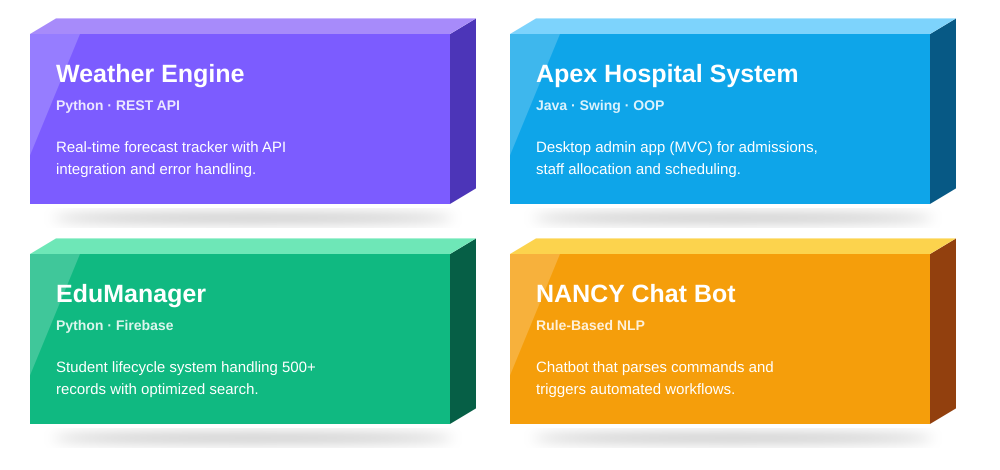
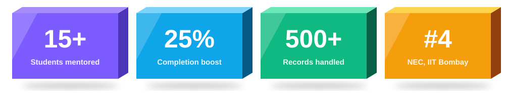

 

IT student specializing in **software and game development**, building with **Python, Java and full-stack web tools**. 
🎓 I.M.Sc. IT, Silver Oak University &nbsp;·&nbsp; 💼 Python Development Intern, Masterly Solutions &nbsp;·&nbsp; 🗣️ Gujarati · English · Hindi

<a href="https://github.com/yash-sapavadiya-07/Weather-Engine-Real-Time-Python-Weather-Tracker"><b>Weather Engine ↗</b></a> &nbsp;·&nbsp;
<a href="https://github.com/yash-sapavadiya-07/Apex-Hospital-Management-System"><b>Apex Hospital ↗</b></a> &nbsp;·&nbsp;
<a href="https://github.com/yash-sapavadiya-07/edumanager"><b>EduManager ↗</b></a> &nbsp;·&nbsp;
<a href="https://github.com/yash-sapavadiya-07/NANCY-CHAT-BOT"><b>NANCY ↗</b></a>

🥇 Startup Bootcamp Champion (2023) &nbsp;·&nbsp; 🧭 Co-Lead, Technical Dept., E-Cell COE 
📜 Electronic Arts · Deloitte · TCS simulations (2025) &nbsp;·&nbsp; C-DAC Pune Programming Diploma (2024)

